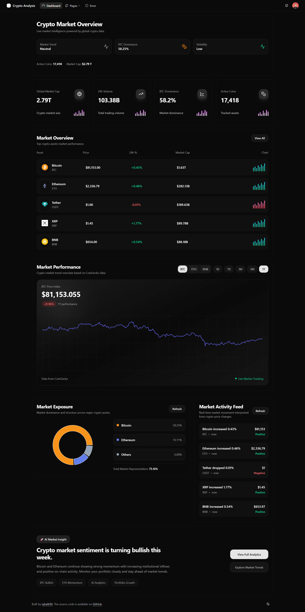

# 📊 Crypto Analytics

Crypto Analytics adalah dashboard analitik cryptocurrency berbasis React + Vite dengan arsitektur scalable dan modular. Project ini fokus pada performa, separation of concern, dan struktur feature-based untuk pengembangan jangka panjang.

## 📸 Screenshot



---

## 🚀 Tech Stack

- React + Vite  
- TypeScript  
- React Router  
- TanStack Query  
- Shadcn UI  
- Lucide Icons  
- Tailwind CSS  

---

## 🧠 Architecture Overview

Feature-based architecture dengan pemisahan:

- Feature layer (domain logic)
- Shared layer (reusable UI & utils)
- Service layer (API handling)
- Hook layer (data fetching abstraction)

```txt
src/
│
├── app/
│   └── providers/
│
├── config/
├── contexts/
│
├── features/
│   └── dashboard/
│       ├── components/
│       ├── hooks/
│       ├── pages/
│       ├── services/
│       ├── store/
│       └── types/
│
├── shared/
│   ├── components/
│   ├── constants/
│   ├── hooks/
│   ├── layouts/
│   ├── services/
│   │   ├── api.ts
│   │   ├── http-client.ts
│   │   └── interceptors.ts
│   ├── types/
│   └── utils/
│
└── styles/
```

## 🔌 Data Flow

UI → Hook → TanStack Query → Service → HTTP Client → API → Cache → UI

---

## ⚙️ Key Principles

- Separation of concerns
- Service layer pattern
- Feature isolation
- Shared-first approach

---

## 📦 Example Feature
```txt
features/dashboard/
├── hooks/use-global-market.ts
├── services/global-market.service.ts
├── components/stats-card.tsx
├── pages/dashboard-page.tsx
```
---

## 📊 Data Strategy

- TanStack Query caching
- No redundant API calls
- Derived data separation

---

## 🎯 Goals

- Scalable crypto analytics dashboard
- Clean architecture
- High performance UI
- Maintainable codebase

---

## 🧩 Future Improvements

- WebSocket real-time data
- Candlestick chart module
- Portfolio tracking
- Advanced indicators
